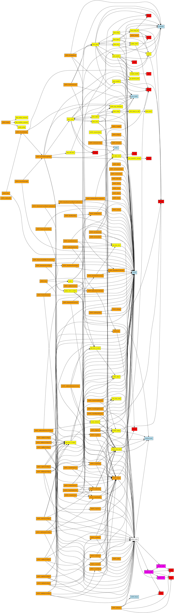

# cJSON
cJSON in Rust

```
* All of the Rust code has been generated automatically using ChatGPT!
* When the CI fails, submit error message to ChatGPT!
* ALL Unit and Integration tests pass!
* No proper formatting yet, but that is very easy to fix. Same for warnings.
```

## Refactoring and Modularizing Around the `CJSON` Struct sugested by Copilot

To refactor and modularize the code around the `CJSON` struct, follow these steps:

### 1. Create Separate Modules:
- **cjson.rs:** Keep the definition of the `CJSON` struct and related methods.
- **error.rs:** Move error handling functions and the `Error` struct here.
- **parse.rs:** Move parsing-related functions and the `ParseBuffer` struct here.
- **print.rs:** Move printing-related functions and the `PrintBuffer` struct here.
- **constants.rs:** Move constants like `CJSON_*` types and flags here.

### 2. Refactor `src/cJSON.rs`:
- Keep only the `CJSON` struct and its direct methods.
- Use `mod` to include new modules.

### 3. Update Imports:
- Ensure all files import the required modules/functions correctly.

### Example File Structure:

#### `src/cJSON.rs`
```rust
pub mod error;
pub mod parse;
pub mod print;
pub mod constants;

pub struct CJSON {
    pub next: Option<Rc<RefCell<CJSON>>>,
    pub prev: Option<Rc<RefCell<CJSON>>>,
    pub child: Option<Rc<RefCell<CJSON>>>,
    pub item_type: u32,
    pub valuestring: Option<String>,
    pub valueint: i32,
    pub valuedouble: f64,
    pub string: Option<String>,
}

// Functions related to CJSON struct...
```

#### `src/error.rs`
```rust
pub struct Error {
    pub json: Option<Vec<u8>>,
    pub position: usize,
}

pub fn cjson_get_error_ptr() -> Option<String> {
    // Implementation...
}

// Other error handling functions...
```

#### `src/parse.rs`
```rust
pub struct ParseBuffer {
    pub content: Vec<u8>,
    pub offset: usize,
    pub depth: usize,
    pub length: usize,
}

// Parsing functions...
```

#### `src/print.rs`
```rust
pub struct PrintBuffer<'a> {
    buffer: &'a mut String,
    length: usize,
    offset: usize,
    noalloc: bool,
    format: bool,
}

// Printing functions...
```

#### `src/constants.rs`
```rust
pub const CJSON_INVALID: u32 = 0;
pub const CJSON_FALSE: u32 = 1 << 0;
// Other constants...
```

This refactoring approach will help to modularize your code, making it more maintainable and scalable.

### Whole Program Dependency Graph

