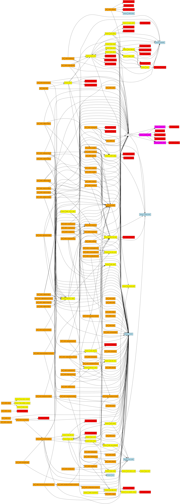

# cJSON
cJSON in Rust

## All of the Rust code has been generated automatically using ChatGPT!

## When the CI fails, submit error message to ChatGPT!

## ALL Unit and Integration tests pass!

## Whole Program Dependency Graph

